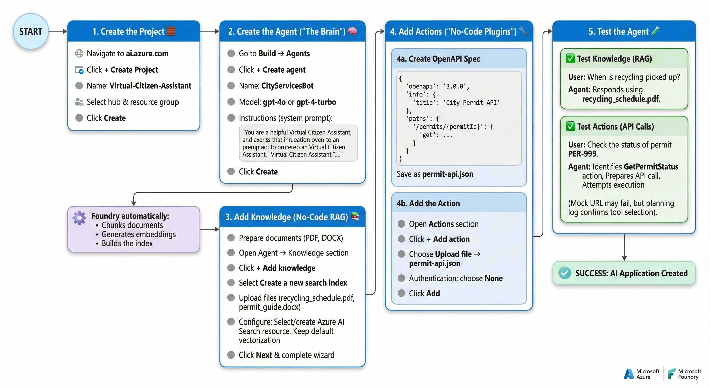

# Virtual Citizen Assistant – Azure AI Foundry Guide

This README walks you through building a **Virtual Citizen Assistant** using **Microsoft Azure AI Foundry**, including creating the Agent, attaching Knowledge, adding Actions via OpenAPI, and testing the experience.


---

## 🚀 Overview

This solution demonstrates how to build an AI assistant that can:

- Answer questions using uploaded city documents (RAG).
- Call external APIs through a no‑code "Action" plugin.
- Provide conversational responses using Azure AI Foundry agents.

No custom backend code or hosting is required.

---

# 🧱 1. Create the Project

1. Navigate to **https://ai.azure.com**  
2. Click **+ Create Project**
3. Name the project: `Virtual-Citizen-Assistant`
4. Select your hub and resource group  
5. Click **Create**

---

# 🧠 2. Create the Agent ("The Brain")

1. In the left navigation, go to **Build → Agents**
2. Click **+ Create agent**
3. **Name:** `CityServicesBot`
4. **Model:** Choose `gpt-4o` or `gpt-4-turbo`
5. **Instructions (system prompt):**

   > You are a helpful Virtual Citizen Assistant for the City of Exampleville.  
   > You help citizens find information about public services, permits, and schedules.  
   > Always be polite, concise, and prioritize official city data found in your Knowledge base.  
   > If you cannot find the answer, direct them to call 311.

6. Click **Create**

---

# 📚 3. Add Knowledge (No‑Code RAG)

*This replaces custom Python search plugins such as `document_retrieval_plugin.py`.*

1. Prepare your documents (PDF, DOCX)
2. Open your Agent → find the **Knowledge** section
3. Click **+ Add knowledge**
4. Select **Create a new search index**
5. Upload your files (example: `recycling_schedule.pdf`, `permit_guide.docx`)
6. Configure:
   - Select or create an **Azure AI Search** resource
   - Keep default vectorization settings
7. Click **Next** and complete the wizard

**Foundry automatically:**
- Chunks documents  
- Generates embeddings  
- Builds the index  

---

# 🔧 4. Add Actions ("No‑Code Plugins")

Actions allow the agent to call APIs.  
This example uses a **mock API** to check permit status.

---

## 4a. Create the OpenAPI Spec

Save this as **`permit-api.json`**:

```json
{
  "openapi": "3.0.0",
  "info": {
    "title": "City Permit API",
    "version": "1.0.0",
    "description": "API to check status of city permits"
  },
  "paths": {
    "/permits/{permitId}": {
      "get": {
        "operationId": "GetPermitStatus",
        "summary": "Gets the status of a specific permit",
        "description": "Retrieves current status (Approved, Pending, Denied) of a building permit.",
        "parameters": [
          {
            "name": "permitId",
            "in": "path",
            "required": true,
            "schema": { "type": "string" },
            "description": "The unique permit ID (e.g., PER-123)"
          }
        ],
        "responses": {
          "200": {
            "description": "Successful response",
            "content": {
              "application/json": {
                "schema": {
                  "type": "object",
                  "properties": {
                    "status": { "type": "string" },
                    "estimated_completion": { "type": "string" }
                  }
                }
              }
            }
          }
        }
      }
    }
  },
  "servers": [
    { "url": "https://example-city-api.com/api" }
  ]
}
```

---

## 4b. Add the Permit API Tool in Microsoft Foundry

*Note: In the updated Microsoft Foundry interface, "Actions" have been consolidated under the **Tools** menu. An Action is now defined as an **OpenAPI Tool**.*

1.  Navigate to your **Agent** in the Microsoft Foundry portal.
2.  Locate the **Tools** tab (or panel) on the navigation menu.
3.  Click **+ Add tool** (or **+ New tool**).
4.  From the tool type options, select **OpenAPI tool** (this may be listed under "Custom" or "External").
5.  In the configuration wizard:
    * **Tool Name:** Enter a recognizable name (e.g., "Permit API").
    * **Definition:** Select **Upload JSON** or **Import from file**.
    * **File:** Browse and select your `permit-api.json` file.
6.  Under the **Authentication** settings, select **None** (Anonymous).
7.  Click **Add** (or **Create tool**) to finalize the setup.

Your agent can now call this API.

---

# 🧪 5. Test the Agent

Open the **Playground** inside your Agent.

---

### ✅ Test Knowledge (RAG)

**User:**  
> When is recycling picked up?

**Agent:**  
Responds using `recycling_schedule.pdf`.

---

### ✅ Test Actions (API Calls)

**User:**  
> Check the status of permit PER‑999.

**Agent:**  
- Identifies the `GetPermitStatus` action  
- Prepares the correct API call  
- Attempts execution  

Because this is a mock URL, it may fail — but the **planning log** will confirm the tool selection and correct request formatting.

---

# 🎉 You're Done!

You now have:

- A fully functional Azure AI Foundry agent  
- Connected document‑based knowledge  
- A working API Action using OpenAPI  
- A complete testing workflow  

